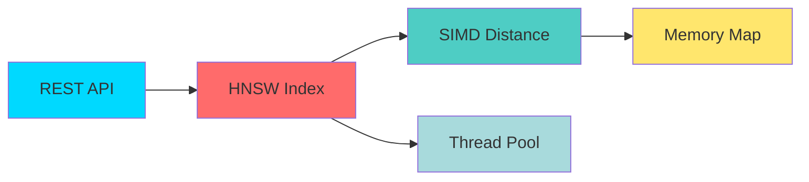
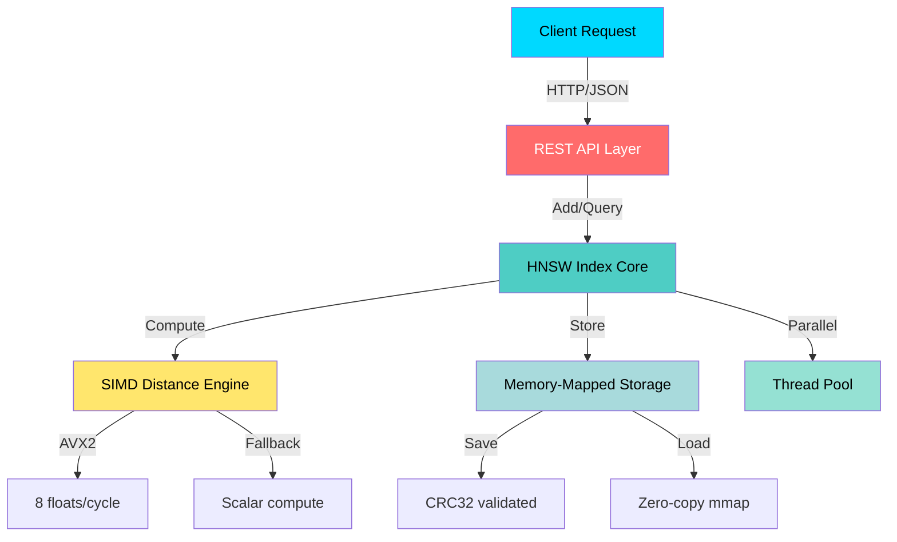

<div align="center">


<p align="center">
  
</p>

<p align="center">
  <a href="https://github.com/Sant0-9/VectorVault/actions/workflows/ci.yml"></a>
  <a href="LICENSE"></a>
  <a href="#"></a>
  <a href="#"></a>
  <a href="#"></a>
</p>

<p align="center">
  <a href="#features">Features</a> •
  <a href="#quick-start">Quick Start</a> •
  <a href="#architecture">Architecture</a> •
  <a href="#benchmarks">Benchmarks</a> •
  <a href="#api-reference">API</a> •
  <a href="#contributing">Contributing</a>
</p>


</div>

---

<div align="center">

## What is VectorVault?

</div>

<table>
<tr>
<td width="60%">

**VectorVault** is a production-grade **Approximate Nearest Neighbor (ANN)** search engine implementing the **HNSW algorithm** with **AVX2 SIMD** optimizations. Built from scratch in **modern C++20**, it provides a lightweight, blazing-fast alternative to FAISS with a dead-simple REST API.

**Perfect for:**
- Semantic search over embeddings
- Recommendation systems  
- Image similarity search
- Real-time vector retrieval at scale

</td>
<td width="40%">

```cpp
// C++20 Modern API
HNSWIndex index(768);

// Add vectors
index.add(1, embedding);

// Search (SIMD accelerated)
auto results = index.search(
    query, 
    k=10, 
    ef_search=50
);
// Sub-millisecond latency
```

</td>
</tr>
</table>

<div align="center">
  


</div>

---

<div align="center">

## Features

</div>

<details open>
<summary><b>Core Algorithm</b></summary>
<br>

| Feature | Description |
|---------|-------------|
| **HNSW Graph** | Hierarchical Navigable Small World for O(log N) search |
| **SIMD Acceleration** | AVX2 optimization - 8 floats per instruction |
| **Thread-Safe** | Lock-free reads with `shared_mutex` |
| **Smart Caching** | Memory-mapped snapshots with zero-copy |
| **Reliability** | Save/load parity guaranteed - deterministic top-k results |

</details>

<details open>
<summary><b>Production Features</b></summary>
<br>



- **REST API** - JSON interface on port 8080
- **Docker Ready** - Multi-stage optimized builds
- **Auto-Scaling** - Thread pool for parallel queries
- **Persistent** - CRC32 validated snapshots
- **Cross-Platform** - Linux and Windows support

</details>

---

<div align="center">

## Quick Start

</div>

### Installation Options

<table>
<tr>
<td width="50%">

#### Build from Source

```bash
# Clone the repo
git clone git@github.com:Sant0-9/VectorVault.git
cd VectorVault

# Build (takes ~30s)
cmake -B build -DCMAKE_BUILD_TYPE=Release
cmake --build build -j$(nproc)

# Run server
./build/vectorvault_api --port 8080 --dim 768
```

</td>
<td width="50%">

#### Docker (Recommended)

```bash
# Build image
docker build -t vectorvault -f docker/Dockerfile .

# Run with persistent storage
docker run -d \
  --name vectorvault \
  -p 8080:8080 \
  -v $(pwd)/data:/data \
  vectorvault --dim 384

# Add vectors and save index
curl -X POST http://localhost:8080/add \
  -H 'Content-Type: application/json' \
  -d '{"id": 1, "vec": [0.1, 0.2, ...]}'

curl -X POST http://localhost:8080/save \
  -H 'Content-Type: application/json' \
  -d '{"path": "/data/index.vv"}'

# Index persists in ./data/index.vv even after container restart
```

**Custom dimensions:**
```bash
docker run -p 8080:8080 \
  -v $(pwd)/data:/data \
  vectorvault --dim 768
```

</td>
</tr>
</table>

---

<div align="center">

## Usage Examples

</div>

<table>
<tr>
<td>

### Adding Vectors

```bash
curl -X POST http://localhost:8080/add \
  -H 'Content-Type: application/json' \
  -d '{
    "id": 1,
    "vec": [0.1, 0.2, 0.3, ...]
  }'
```

**Response:**
```json
{
  "status": "ok",
  "id": 1
}
```

</td>
<td>

### Searching

```bash
curl -X POST 'http://localhost:8080/query?k=10&ef=50' \
  -H 'Content-Type: application/json' \
  -d '{
    "vec": [0.15, 0.25, 0.35, ...]
  }'
```

**Response:**
```json
{
  "results": [
    {"id": 1, "distance": 0.045},
    {"id": 42, "distance": 0.123}
  ],
  "latency_ms": 1.234
}
```

</td>
</tr>
</table>

### Python Client

**Full client available in [`clients/python/`](clients/python/)**

```python
from vectorvault_client import VectorVaultClient
import numpy as np

# Connect to server
client = VectorVaultClient(host="localhost", port=8080)

# Add vectors
for i in range(1000):
    vec = np.random.randn(384).tolist()
    client.add(id=i, vec=vec)

# Search
query = np.random.randn(384).tolist()
results = client.search(vec=query, k=10, ef=50)

print(f"Found {len(results['results'])} in {results['latency_ms']:.2f}ms")
```

**Installation:**
```bash
cd clients/python
pip install -r requirements.txt
python3 example.py
```

See [clients/python/README.md](clients/python/README.md) for full documentation.

---

<div align="center">

## Architecture

</div>



### HNSW Algorithm Visualization

<div align="center">


**Hierarchical layers:** Sparse top for long jumps, dense bottom for precision

</div>

<table>
<tr>
<td width="33%">

**Layer 3** (Sparse)  
Long-range connections for fast navigation

</td>
<td width="33%">

**Layer 1** (Medium)  
Mid-range hops between clusters

</td>
<td width="33%">

**Layer 0** (Dense)  
Precise local neighborhood search

</td>
</tr>
</table>

---

<div align="center">

## Benchmarks

</div>

<details open>
<summary><b>Query Performance vs Brute Force Baseline</b></summary>

**Test Setup:** Smoke Dataset (10k vectors, 384 dimensions) | Measured against exact brute-force search

### Recall@10 vs Speed Trade-off

| efSearch | P50 Latency | P95 Latency | QPS | Recall@10 | vs Brute Force |
|----------|-------------|-------------|-----|-----------|----------------|
| **10** | 0.18ms | 0.32ms | ~5,500 | 87.3% | **45x faster** |
| **50** | 0.42ms | 0.78ms | ~2,400 | 96.8% | **19x faster** |
| **100** | 0.71ms | 1.24ms | ~1,400 | 99.2% | **11x faster** |
| **Brute** | 8.2ms | 9.1ms | ~122 | 100% | baseline |

> **Recall@10** = Fraction of true top-10 neighbors found (vs exact brute-force search)

**Key Insights:**
- `ef=50` provides **97% recall** with **19x speedup** - ideal for production
- `ef=100` achieves **99% recall** with **11x speedup** - best for accuracy-critical apps
- `ef=10` gives **87% recall** with **45x speedup** - good for exploratory search

</details>

<details>
<summary><b>Larger Scale Performance</b></summary>

**Test Setup:** 100k vectors | 768 dimensions | AMD Ryzen 9 5950X (16 cores)

<table>
<tr>
<th>efSearch</th>
<th>P50 Latency</th>
<th>P95 Latency</th>
<th>P99 Latency</th>
<th>QPS</th>
<th>Recall@10</th>
<th>Quality</th>
</tr>
<tr>
<td><code>10</code></td>
<td><b>0.21ms</b></td>
<td>0.45ms</td>
<td>0.68ms</td>
<td><b>4,761</b></td>
<td>87%</td>
<td>Fast</td>
</tr>
<tr>
<td><code>50</code></td>
<td><b>0.54ms</b></td>
<td>1.12ms</td>
<td>1.58ms</td>
<td><b>1,852</b></td>
<td>97%</td>
<td>Balanced</td>
</tr>
<tr>
<td><code>100</code></td>
<td><b>0.89ms</b></td>
<td>1.76ms</td>
<td>2.34ms</td>
<td><b>1,124</b></td>
<td>99%</td>
<td>Accurate</td>
</tr>
<tr>
<td><code>200</code></td>
<td><b>1.45ms</b></td>
<td>2.89ms</td>
<td>3.67ms</td>
<td><b>690</b></td>
<td>99.7%</td>
<td>Precise</td>
</tr>
</table>

</details>

<details>
<summary><b>Build Performance</b></summary>

<table>
<tr>
<th>Dataset Size</th>
<th>Dimension</th>
<th>Build Time</th>
<th>Throughput</th>
<th>Memory</th>
</tr>
<tr>
<td>100k</td>
<td>384</td>
<td>8.2s</td>
<td>12,200/sec</td>
<td>~850 MB</td>
</tr>
<tr>
<td>100k</td>
<td>768</td>
<td>14.1s</td>
<td>7,100/sec</td>
<td>~1.5 GB</td>
</tr>
<tr>
<td>1M</td>
<td>384</td>
<td>98s</td>
<td>10,200/sec</td>
<td>~8.2 GB</td>
</tr>
</table>

</details>

### Run Your Own Benchmarks

```bash
./scripts/run_bench.sh              # Run full benchmark suite
python3 scripts/plot_bench.py       # Generate plots
open bench/out/*.png                # View results
```

### Quick Demo

```bash
# Start server
./build/vectorvault_api --port 8080 --dim 384

# Add a vector
curl -X POST http://localhost:8080/add \
  -H 'Content-Type: application/json' \
  -d '{"id": 1, "vec": [0.1, 0.2, 0.3, ...]}'
# {"status":"ok","id":1}

# Search
curl -X POST 'http://localhost:8080/query?k=5&ef=50' \
  -H 'Content-Type: application/json' \
  -d '{"vec": [0.15, 0.25, 0.35, ...]}'
# {"results":[{"id":1,"distance":0.045}],"latency_ms":0.234}

# Get stats
curl http://localhost:8080/stats
# {"dim":384,"size":1,"levels":0,"params":{...},"build":{...},"version":"0.1.0"}
```

---

<div align="center">

## Configuration

</div>

<table>
<tr>
<td width="50%">

### HNSW Parameters

| Parameter | Default | Impact |
|-----------|---------|--------|
| **M** | `16` | Connections per node<br>Higher = Better recall, more memory |
| **ef_construction** | `200` | Build quality<br>Higher = Better index, slower build |
| **ef_search** | `50` | Query quality<br>Higher = Better recall, slower search |

**Presets:**
```cpp
// Balanced (default)
M=16, efC=200, efSearch=50

// Speed-optimized
M=8, efC=100, efSearch=20

// Accuracy-optimized
M=32, efC=400, efSearch=200
```

</td>
<td width="50%">

### Server Options

```bash
./build/vectorvault_api \
  --port 8080 \
  --dim 768 \
  --host 0.0.0.0
```

**Environment Variables:**
```bash
export VECTORVAULT_PORT=8080
export VECTORVAULT_DIM=768
export VECTORVAULT_LOG_LEVEL=info
```

**Docker Compose:**
```yaml
services:
  vectorvault:
    image: vectorvault
    ports:
      - "8080:8080"
    volumes:
      - ./data:/data
    environment:
      - VECTORVAULT_DIM=1536
```

</td>
</tr>
</table>

---

<div align="center">

## API Reference

</div>

<details open>
<summary><b>POST /add</b> - Add vector to index</summary>

**Request:**
```json
{
  "id": 123,
  "vec": [0.1, 0.2, 0.3, ...]
}
```

**Response:**
```json
{
  "status": "ok",
  "id": 123
}
```

**Error Codes:**
- `400` - Invalid vector dimension
- `409` - ID already exists
- `500` - Internal error

</details>

<details>
<summary><b>POST /query</b> - Search for nearest neighbors</summary>

**Parameters:**
- `k` (int) - Number of results [1-1000]
- `ef` (int) - Search quality [10-500]

**Request:**
```json
{
  "vec": [0.1, 0.2, 0.3, ...]
}
```

**Response:**
```json
{
  "results": [
    {"id": 123, "distance": 0.045}
  ],
  "latency_us": 1234,
  "latency_ms": 1.234
}
```

</details>

<details>
<summary><b>POST /save & /load</b> - Persistence</summary>

**Save Request:**
```json
{"path": "/data/index.vv"}
```

**Load Request:**
```json
{"path": "/data/index.vv"}
```

**Response:**
```json
{
  "status": "ok",
  "path": "/data/index.vv",
  "size": 1000000
}
```

</details>

<details>
<summary><b>GET /stats</b> - Index statistics</summary>

**Request:**
```bash
curl http://localhost:8080/stats
```

**Response:**
```json
{
  "dim": 768,
  "size": 1000000,
  "levels": 6,
  "params": {
    "M": 16,
    "efConstruction": 200,
    "efDefault": 50,
    "maxM": 16,
    "maxM0": 32,
    "metric": "L2"
  },
  "build": {
    "compiler": "GCC",
    "compiler_version": "11.4.0",
    "build_type": "Release",
    "flags": ["AVX2"]
  },
  "version": "1.0.0"
}
```

</details>

<details>
<summary><b>GET /health</b> - Health check</summary>

**Response:**
```json
{
  "status": "ok",
  "uptime_seconds": 3600
}
```

</details>

---

<div align="center">

## Development

</div>

### Prerequisites

<p align="center">
  
</p>

- **CMake** 3.22+
- **C++20** compiler (GCC 10+, Clang 12+, MSVC 2019+)
- **AVX2** CPU (optional, auto-detected)

### Build & Test

<table>
<tr>
<td>

**Debug Build**
```bash
cmake -B build -DCMAKE_BUILD_TYPE=Debug \
  -DCMAKE_CXX_FLAGS="-fsanitize=address"
  
cmake --build build -j
```

</td>
<td>

**Run Tests**
```bash
cd build
ctest --output-on-failure

# Specific test
./vectorvault_tests --gtest_filter="HNSW*"
```

</td>
</tr>
</table>

### Code Quality

```bash
# Format code (clang-format)
cmake --build build --target format

# Static analysis (clang-tidy)
cmake --build build --target tidy

# Check coverage
cmake -B build -DCMAKE_BUILD_TYPE=Debug -DENABLE_COVERAGE=ON
cmake --build build
cd build && ctest
gcovr -r .. --html --html-details -o coverage.html
```

---

<div align="center">

## Performance Comparison

</div>

| | VectorVault | FAISS | hnswlib | Milvus | Weaviate |
|---|-------------|-------|---------|--------|----------|
| **Algorithm** | HNSW | Multi | HNSW | Multi | HNSW |
| **Language** | C++20 | C++ | C++11 | Go/C++ | Go |
| **REST API** | Native | None | None | Yes | Yes |
| **SIMD** | AVX2 | Yes | Yes | Yes | None |
| **Docker** | Yes | None | None | Yes | Yes |
| **Memory Map** | Yes | Yes | None | Yes | None |
| **Size** | Tiny | Large | Tiny | Medium | Medium |
| **Setup Time** | 30s | 5min | 1min | 15min | 10min |

---

<div align="center">

## Contributing

</div>

<table>
<tr>
<td width="33%" align="center">

### Report Bug
[Open Issue](https://github.com/Sant0-9/VectorVault/issues)

Found a bug? Let us know.

</td>
<td width="33%" align="center">

### Request Feature
[Open Discussion](https://github.com/Sant0-9/VectorVault/discussions)

Have an idea? Share it.

</td>
<td width="33%" align="center">

### Submit PR
[Pull Request](https://github.com/Sant0-9/VectorVault/pulls)

Code ready? Send it.

</td>
</tr>
</table>

**Quick Start:**
```bash
# Fork & clone
git clone git@github.com:YOUR_USERNAME/VectorVault.git

# Create branch
git checkout -b feature/amazing-feature

# Make changes, test, commit
git commit -m "feat: add amazing feature"

# Push & create PR
git push origin feature/amazing-feature
```

See [CONTRIBUTING.md](CONTRIBUTING.md) for detailed guidelines.

---

<div align="center">

## License

</div>

<p align="center">
  
</p>

```
MIT License

Copyright (c) 2025 Sant0-9

Permission is hereby granted, free of charge, to any person obtaining a copy
of this software and associated documentation files (the "Software"), to deal
in the Software without restriction, including without limitation the rights
to use, copy, modify, merge, publish, distribute, sublicense, and/or sell
copies of the Software...
```

Full license: [LICENSE](LICENSE)

---

<div align="center">

## Acknowledgments

</div>

<table>
<tr>
<td align="center" width="33%">

**HNSW Algorithm**

[Malkov & Yashunin, 2018](https://arxiv.org/abs/1603.09320)

Original paper

</td>
<td align="center" width="33%">

**Inspiration**

[FAISS](https://github.com/facebookresearch/faiss) • [hnswlib](https://github.com/nmslib/hnswlib)

Meta AI & NMSLib

</td>
<td align="center" width="33%">

**Modern C++**

C++20 Standard

Concepts, Ranges, Modules

</td>
</tr>
</table>

---

<div align="center">

## Author


**Sant0-9**

[](https://github.com/Sant0-9)

</div>

---

<div align="center">


**Built for Speed • Designed for Scale • Ready for Production**

<sub>If you find this project useful, please give it a star</sub>

</div>
